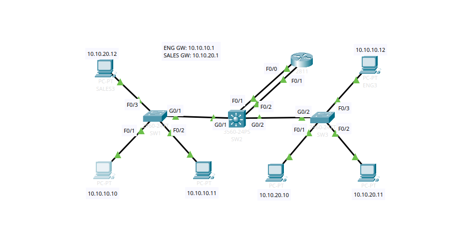

# Cisco VLAN & Inter-VLAN Routing Troubleshooting Lab




## Lab Goals Achieved
- Troubleshoot and fix configuration errors on SW1, SW2, and SW3 to restore full connectivity
- Ensure intra-VLAN pings work (e.g., Eng1 → Eng3)
- Ensure inter-VLAN pings work (e.g., Eng1 → Sales1) via Router-on-a-Stick on R1
- No changes to VTP modes or domains (as per lab rules)
- Used only allowed troubleshooting commands (no `show run`)

## Identified Issues & Fixes
The lab had one error per switch. Here's what I found and fixed:

### SW3 (VTP Client) Issue
- Gig0/2 (link to SW2) was configured as **access port in VLAN 1** instead of trunk.
- This blocked VTP updates from propagating, so VLANs 10 & 20 were missing on SW3.

**Fix:**
```
SW3(config)# interface gig0/2
SW3(config-if)# switchport mode trunk
SW3(config-if)# switchport trunk native vlan 199
```
SW1 (VTP Server) Issue

Fa0/1 (connected to Eng1) was in wrong VLAN: Sales (20) instead of Eng (10).

Fix:
```
SW1(config)# interface f0/1
SW1(config-if)# switchport access vlan 10
```
After fix: Intra-VLAN pings in Eng VLAN started working.

SW2 (VTP Transparent) Issue

Fa0/1 (link to R1 Fa0/0) was configured as access port in Eng VLAN 10 instead of trunk.
This broke Router-on-a-Stick, as only VLAN 10 traffic reached R1.

Fix:
```
SW2(config)# interface f0/1
SW2(config-if)# switchport mode trunk
SW2(config-if)# switchport trunk encapsulation dot1q
```
After fix: Inter-VLAN pings started working.

Verification Results
Intra-VLAN Connectivity (After Fixes)
```
ENG1 → ENG3 (10.10.10.10 → 10.10.10.12) → 100% success (after fixing SW1 & SW3)
SALES1 → SALES3 (10.10.20.10 → 10.10.20.12) → 100% success
```

Inter-VLAN Connectivity (After All Fixes)
```
ENG1 → SALES1 (10.10.10.10 → 10.10.20.10) → First packet timeout (ARP), then 100% success
ENG1 → Sales GW (10.10.20.1) → 100% success
```

Key Takeaways & Best Practices Learned

Always start with intra-VLAN connectivity checks (same VLAN pings)
Use show vlan brief to verify VLAN existence and port assignments
Use show interfaces switchport and show interfaces trunk for port modes and native VLAN mismatches
VTP Clients can't add VLANs manually – fix trunks/domains first
For Router-on-a-Stick: Router link must be trunk (not access)
Native VLAN mismatches or wrong encaps can silently break things
CDP neighbors helpful for verifying physical connections
Optional hardening (not in lab): Add switchport trunk allowed vlan 10,20,199 on trunks to remove VLAN 1
